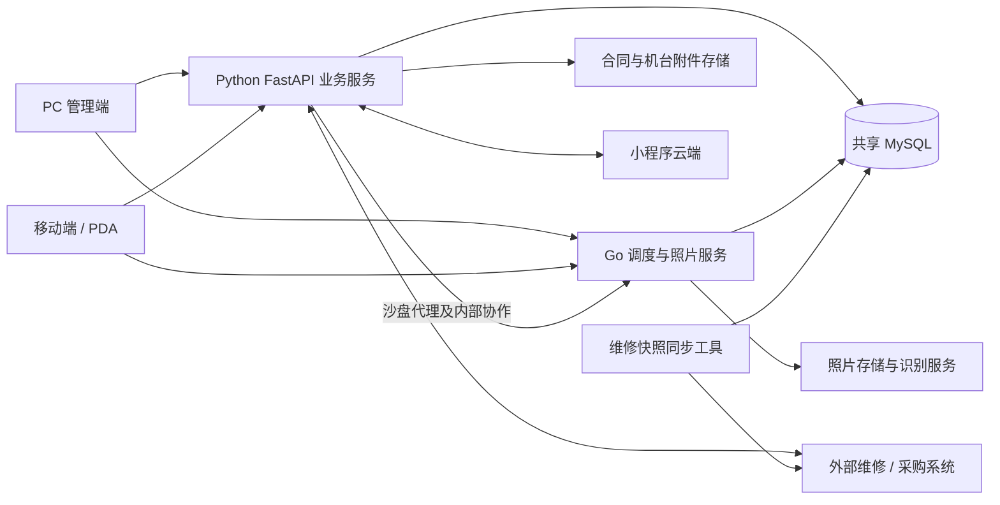
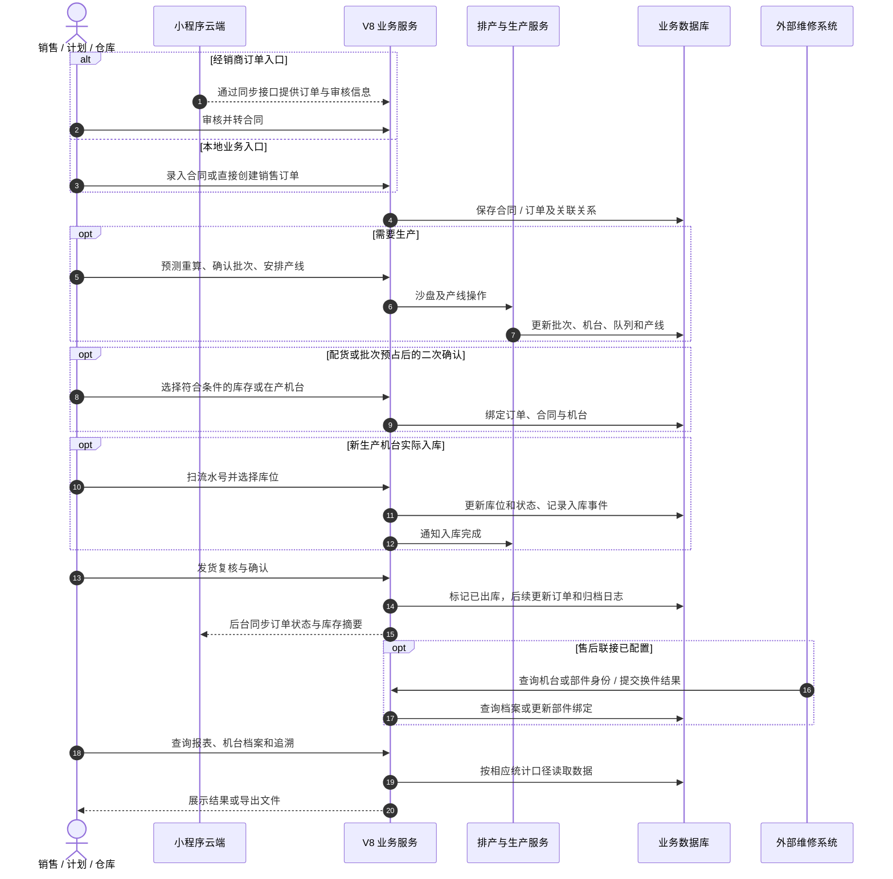
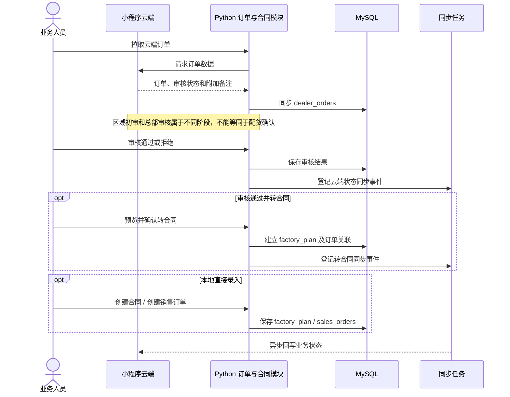
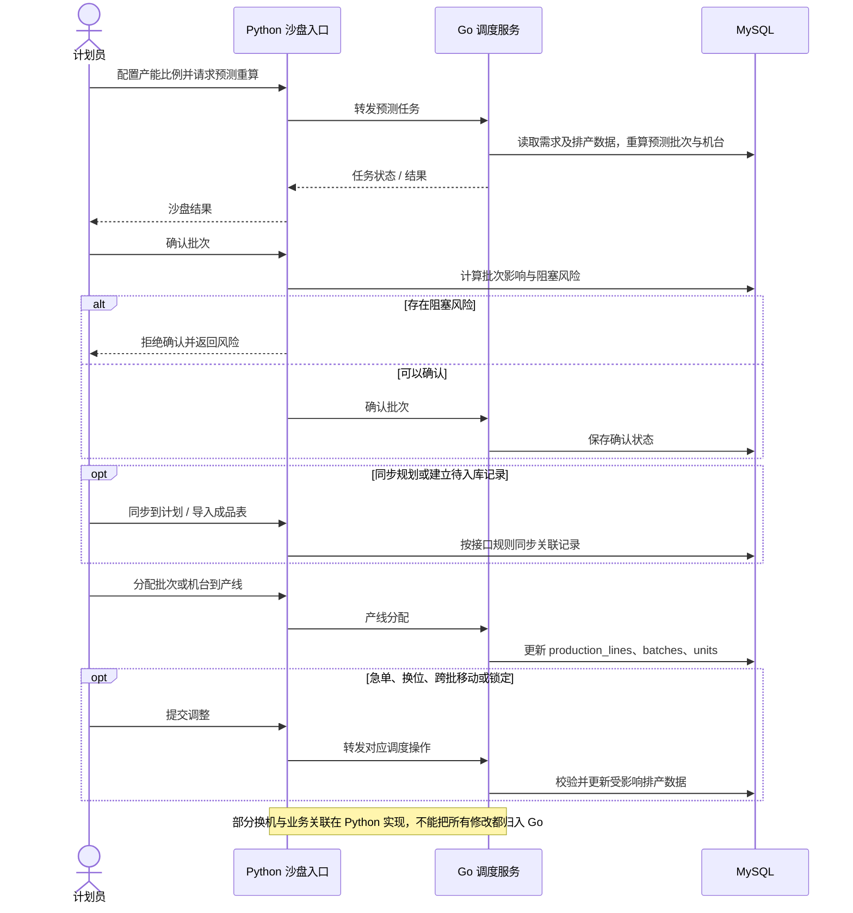
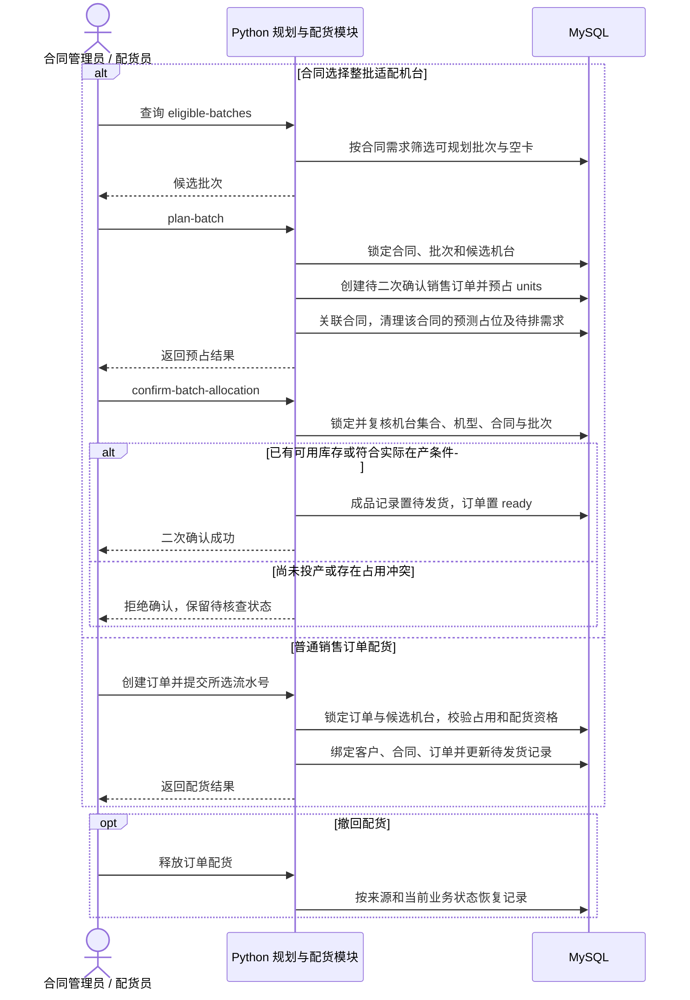
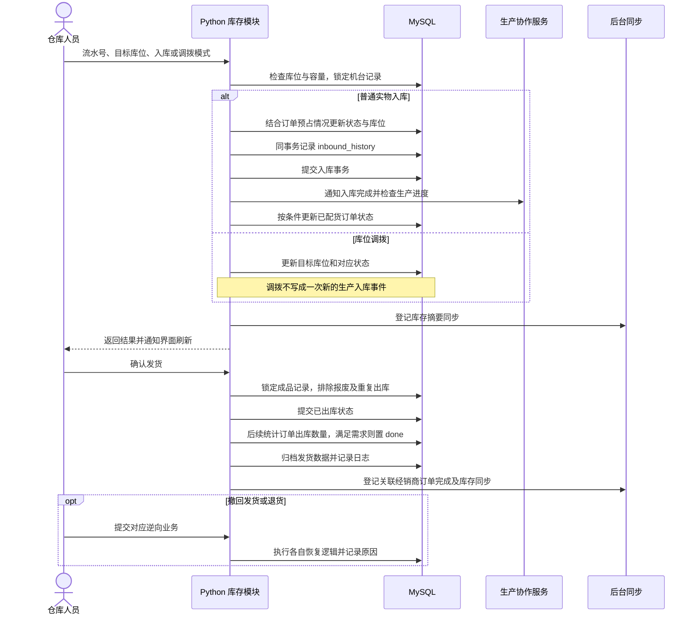
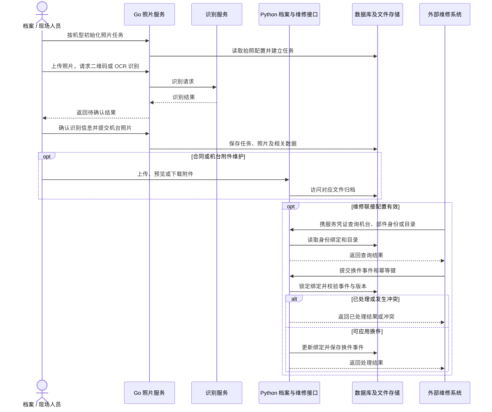
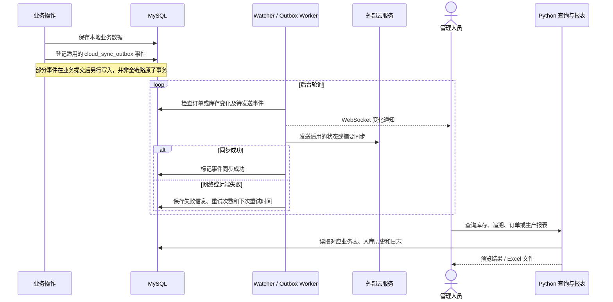

# V8 业务逻辑架构与时序图

核对日期：2026-09-22。依据当前工作区代码（含尚未提交的修改），不是线上部署验证。外部系统只描述本仓库可见的交互契约，不推断其内部实现。

时序图表达操作先后及模块协作，不能独自表达全部静态架构。因此先给组件关系，再给业务总览和分流程。图中箭头表示调用或数据操作，不意味着整条链处在同一数据库事务中。

## 1. 组件与职责

照片接口通过前端代理进入 Go；普通业务接口进入 Python；沙盘多数请求由 Python 校验或处理后转发 Go，也有 Python 直接实现的业务操作。两种后端共享数据库，不是数据库完全隔离的微服务。外部联接是否启用取决于配置和实际部署。

## 2. 业务全景时序

入库和配货的先后可以不同：现货可先入库后配货，在产机台可以先配货后入库；也可以先生产备库再接受销售订单。本图展示协作主线，不要求每笔业务执行全部步骤。

## 3. 订单入口、审核与合同

合同承载生产需求；销售订单承载配货和交付；经销商订单承载外部订单及审核状态。三者有关联，但不是同一张表或同一个状态机。

依据：`api/routes/dealer_orders.py`、`api/routes/planning.py`、`crud/dealer_orders.py`。

## 4. 预测排产与生产执行

预测批次、确认批次、投产和实际入库是不同节点。确认或导入成品表不等于完成实物入库；待排队列也不能直接当作库存。

依据：`api/routes/sandbox.py`、`server/internal/router/router.go`。

## 5. 合同批次规划与销售配货

“待二次确认”是预占阶段；只有已确认批次但尚未投产，不足以通过二次确认。“待发货”和订单 `ready` 也不自动证明实物已入库。

依据：`crud/batch_planning.py:141`、`crud/batch_planning.py:221`、`crud/orders.py:318`、`api/routes/planning.py`。

## 6. 实物入库、调拨和发货

代码边界：`shipping/confirm` 当前未完整强制校验“必须待发货且已有实际入库记录”。因此图中不能写成系统已经保证“未入库绝不允许发货”。库存出库、订单完成、归档和云端事件也不在同一个整体事务里。这里记录事实，不代表认可该规则；若要建立严格交付闭环，应另行补齐前置校验及失败补偿。

依据：`crud/inventory.py`、`api/routes/inventory.py:1251`、`crud/orders.py:477`。

## 7. 机台档案、拍照识别与维修联接

维修工单内部审核、领料及结算不属于本仓库可验证的流程。另有 `repair_sync` 出站快照工具；代码存在不证明线上已开启或完成对接。

依据：`server/internal/router/router.go`、`api/routes/repair_identity.py`、`api/routes/repair_catalog.py`、`crud/repair_component_replacements.py`、`repair_sync/README.md`。

## 8. 异步同步、实时刷新与报表追溯

WebSocket 是刷新通知，最终展示内容仍需以接口读取为准。当前库存快照、生产进度、首次入库完工口径和发货数量是不同指标，不能直接互相替代。不同时间请求的预览与导出也不能默认是同一份快照。

依据：`api/main.py`、`crud/cloud_sync_outbox.py`、`crud/reports.py`、`api/routes/reports.py`、`api/routes/traceability.py`。

## 9. 阅读这些图时的关键边界

| 领域 | 主要事实来源 | 不应混淆的概念 |
| --- | --- | --- |
| 合同需求 | factory_plan | 合同不等于销售订单 |
| 销售履约 | sales_orders | 预占、配货与实物发货不同 |
| 外部订单 | dealer_orders | 审核状态不等于机台状态 |
| 生产执行 | batches、units、production_lines、production_queue | 预测、待投产、在产、完工不同 |
| 库存与位置 | finished_goods_data、库位配置 | 表内有记录不等于已有实物库存 |
| 入库事件 | inbound_history | 当前状态不等于历史首次入库时间 |
| 机台身份 | machine_component_bindings 等档案数据 | 身份绑定不等于当前仓库位置 |
| 同步状态 | cloud_sync_outbox | 本地提交成功不等于远端同步成功 |

登录、用户角色、权限、机型字典、库位布局、日志和缓存是贯穿业务的支撑模块。前端根据权限组织菜单，后端在各自入口实施鉴权；本次没有逐接口审计权限，也没有执行数据库写操作或线上联调。

本次只新增说明文档。以上是当前实现的模块级业务地图，不是每个分支都经过运行验证的形式化规格。
