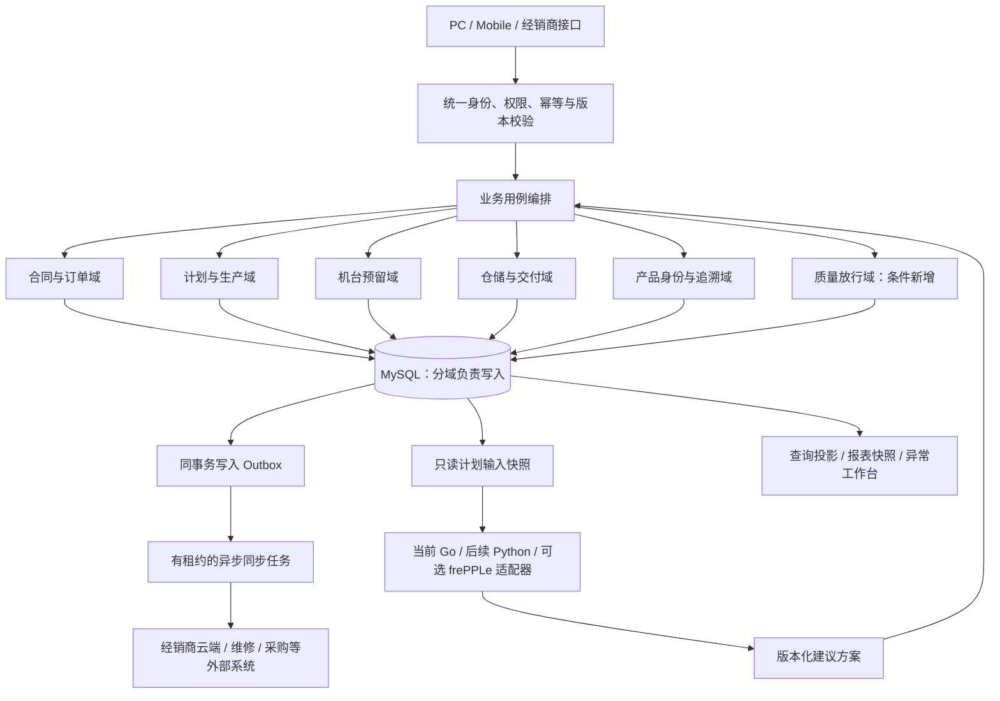

# V8 产销协同：Carbon、ERPNext、frePPLe 差异与演进建议

日期：2026-09-22。对象：当前 `D:\CURSORpj\V8BetaV1.1` 工作区，包括未提交的本地修改。

## 1. 决策结论

建议维持“V8 产销协同与交付管理系统”的定位，以合同需求、机台生产、库存分配、交付和产品追溯为主线。优先借鉴业务模型，暂不整体替换底座，也不为了功能数量把三个项目叠加到现有系统。

- Carbon：借鉴配置化产品、制造任务、质量处置、整机与部件谱系；最适合参考未来产品形态。
- ERPNext：借鉴订单行、独立预留记录、库存流水、交付单据和冲销关系；最适合参考当前数据与事务模型改造。
- frePPLe：借鉴资源日历、约束解释、需求与供应关联；先补齐输入数据，再决定是否试验独立排程引擎。

现阶段最大收益更可能来自“业务状态和数据可信”，而不是增加复杂排程算法。这是基于代码结构的判断，尚无运行指标可以量化收益。

## 2. 证据边界

本次检查了 V8 路由、数据库定义、核心写入、沙盘算法、移动端目录、报表、维修接口和已有迁移 PRD；远端检查了 README、目录、部分模型和官方仓库文档。没有运行三个外部系统，没有连接生产数据库，没有改动业务代码或重算实际排产。

“已有”表示有实现证据，不等于通过端到端验收；“部分”表示存在基础但不足以构成完整业务闭环；“未见”仅指本次检查的核心实现范围；“非职责”不应被当作产品缺陷。外部默认分支不是稳定发布承诺，部署前还要选定正式版本。

| 项目 | 本次核验版本 | 许可与范围 |
|---|---|---|
| Carbon | `main` / `ba5721afef14d14e003bf551fe6ed64f140ac409` | 核心 AGPLv3；`packages/ee` 和文件名含 `.ee.` 的部分另用商业许可。[C0] |
| ERPNext | `develop` / `3c251254b8ff4ffa90d565045c43f64c8e78fe45` | 仓库许可信息为 GPL-3.0；本次对照开发分支模型，不把它作为上线版本建议。[E0] |
| frePPLe | `master` / `29aa9af68688fbf6eea56a406afb6d8656e305cc` | 本次官方文档声明社区版 MIT，企业版另售；交期承诺报价界面明确属于企业/云版本。[F0][F4] |

## 3. 四方业务差异

| 模块 | V8 当前实现 | Carbon 可借鉴能力 | ERPNext 可借鉴能力 | frePPLe 的角色 | V8 应采取的动作 |
|---|---|---|---|---|---|
| 合同与销售订单 | 有合同、销售订单、云端审核；`factory_plan` 承担合同明细，销售需求仍有文本解析。[V1][V2] | 独立销售模块、配置产品与制造任务关联。[C1][C2] | `Sales Order Item` 有独立机型、数量、交期、生产量、交付量、退回量。[E1] | 把需求数量、优先级、交期作为计划输入。[F1] | 优化：建立稳定订单行 ID，保留现有业务入口，不新增另一套订单系统。 |
| 机型与非标配置 | 有机型字典、系列适配、加高识别；部分配置依赖型号与备注解析。[V2] | 配置参数、规则、物料追踪类型。[C2] | 独立物料、BOM、订单行和生产对象。[E1][E3] | 消费已经整理好的产品与资源约束，不代替配置主数据。 | 优化：先结构化影响配货的配置，备注保留自由文本；按订单保存配置版本。 |
| 预测与备货 | 有机型比例、交期排序、容量分批、库存基线、锁定恢复。[V3] | 制造任务与资源模块。[C3] | 生产计划、工单、工作站产能。[E3][E5] | 检查提前期、资源和物料约束；默认求解器也是启发式，不保证全局最优。[F1][F2] | 优化：保留现有规则，补资源日历、预测依据与实际偏差；APS 后置。 |
| 调整预览与方案 | 有调整前快照、风险预览、确认守卫和算法版本展示字段。[V4] | 可参考任务计划与执行的分离。[C3] | 可参考单据计划日期与实际日期分离。[E3][E4] | 约束报告解释为何晚交、缺量。[F3] | 优化：现有快照升级为可重现的方案版本，记录输入时点和发布人，不重复开发已有风险弹窗。 |
| 产线执行 | 有批次派线、部分机台派线、忙闲、手工/入库触发完工。[V5] | Job 与 Operation 级执行模型。[C3] | Work Order、Job Card、工时和实际起止。[E3][E4] | 提供建议排程，实际执行仍应由业务系统反馈。 | 条件新增：先做装配、调试、待检等少量里程碑，再评估工序级报工。 |
| 预占与配货 | 有现货/在产配货、行锁、撤回；新增按批次预占与二次确认。[V6][V7] | 库存、制造、序列追踪相互关联。[C4] | 独立 `Stock Reservation Entry`，关联来源单据、单据行、序列号及交付数量。[E2] | 处理供需分配，不应成为 V8 实际机台占用的第二个权威来源。 | 优先优化：独立 reservation 记录，将“已预留”与“已入库”分离。 |
| 库位与库存 | 有流水号、库位、入库、调拨、入库历史；当前表也保存履约字段。[V8] | 库存和序列/批次模型。[C2][C4] | 库存流水关联单据、仓库、序列号、交易数量。[E6] | 接收可用供应数量和时间，不承担现场扫码记账。 | 优化：事务内记录出入库/调拨事件，增加盘点差异确认，保留现有库位图。 |
| 发货与退回 | 有发货复核、历史和退回接口；主流程先写库存，再更新订单和历史。[V9] | 可参考仓储与交付的领域划分。[C1][C4] | Delivery Note、明细、包装明细、退回原单关系。[E7] | 只参与预计交期与需求满足分析。 | 优先优化：形成发货单头/行、分批发货、冲销和重试幂等。 |
| 产品质量 | 有照片、身份/部件资料；核心业务范围未见完整检验、隔离、复检和放行闭环。 | 质量模块有不合格、返工、处置、检验关联。[C5] | 检验模板、读数、进料/出货/过程检验，关联单据与序列号。[E8] | 接收质量冻结造成的供应不可用，不代替检验。 | 条件新增：轻量终检/交付放行；先明确质检标准、人员和豁免流程。 |
| 整机与部件追溯 | 已有照片任务、部件身份、维修更换回写及幂等事件。[V10] | 实体谱系图，关联制造步骤和追踪实体。[C4] | Serial No 关联工单、库存、质保和维护状态。[E9] | 通常非职责。 | 优化：整机时间线、部件装拆沿革、出厂配置快照；维修工单继续使用现有对接系统。 |
| 报表与交付预警 | 有完工、入库、订单、发货、台账；完工有首次入库口径；预览/导出分别请求。[V11] | 任务计划与实际、制造指标模型。[C3] | 订单行累计生产、交付、退回数量。[E1] | 缺量/晚交及瓶颈原因。[F3] | 新增异常工作台；优化快照导出、指标定义与明细下钻。 |
| 云端与移动执行 | 有经销商同步、Outbox、重试接口、WebSocket、移动扫码；未见通用离线写队列。[V12] | 有 API 扩展及跨模块权限设计。[C1] | 可参考明确的单据接口边界。[E1][E7] | 通过适配器导入需求与供应，导出建议计划。 | 优化既有同步入口，增加对账、请求幂等、失败可见；弱网先保草稿和照片。 |

这里不做“成熟度百分比”或综合打分：代码量、README 功能数量和 GitHub 星数都不能证明适合工厂，也不能证明某项能力已被当前生产环境正确使用。

## 4. 应保留的 V8 优势

1. 经销商审核、云端备注、合同、批次和机台之间已有针对本厂的业务关联。
2. 以单台机床和流水号组织实物交付，适合不同配置、在产预留、现场扫码的工作方式。
3. 现有比例备货、急单、产线卡片、库位地图已形成具体交互，不应因外部产品模型而全部替换。
4. 已有部件身份和维修更换回写，售后追溯不是从零开始。
5. 已有行锁、部分幂等、调整预览、测试和同步重试。优化应扩大这些机制覆盖范围，而不是先建设另一套平台。

外部项目的优势是模型覆盖面；V8 的优势是具体业务适配。替换成本包含历史映射、员工操作变化、云端接口、扫码、照片及维修对接，不能只比较页面。

## 5. 基于原系统的优化项目清单

P0：现有关键写入的发布阻断风险，应先修复或明确限制使用条件。P1：近期业务收益明确。P2：依赖数据/人员条件的后续选项。成本低/中/高是相对改造范围，不是工期承诺；没有团队容量和数据规模依据，不估算天数。

| 编号 | 改造项目 | 优先级 / 成本 | 最小范围与依赖 | 可验收结果 |
|---|---|---|---|---|
| O01 | 后端业务权限收口 | P0 / 中 | 将发货、配货、撤回、改单、照片等写入口映射到权限；现有登录校验不能代替操作授权。发货例见 [V9][V13]。 | 无对应权限的用户直接调用接口被拒绝；拒绝前没有任何业务写入。 |
| O02 | 发货事务与幂等 | P0 / 中高 | 在单一事务中校验并保存发货行、库存事件、订单进度、审计和 Outbox；按订单行核对机型/配置/数量。明确正常入库发货与生产直发两种政策。 | 同一请求重试只产生一次业务结果；中途异常全部回滚；部分缺失机台不能静默形成不完整发货。 |
| O03 | 机台状态与分配拆分 | P1 / 高 | 将生产阶段、物理位置、分配关系、发运状态分别建模；“待发货”暂作为兼容展示值。 | 在产已预留和现货已预留可同时准确展示；不会仅凭预留认定已入库、已完工。 |
| O04 | 订单头、订单行与配置版本 | P1 / 高 | 先为现有合同明细和销售需求建立稳定行 ID、数量、配置、交期；保留旧字段用于兼容导出。 | 相同机型不同配置可独立配货；改单能列出受影响机台；新逻辑不从备注反推核心需求。 |
| O05 | 独立机台预留记录 | P1 / 中高 | 延续现有二次确认；记录订单行、机台、来源、预留/确认/释放时间、操作者及原因。不得擅自增加自动过期。 | 同一实物只有一个有效占用；撤回有原因和历史；二次确认准确对应原预占集合。 |
| O06 | 定向更新替代全量回写 | P1 / 中高 | 发货等流程不再读全体订单后回写整张快照；更新当前订单和变更字段，加入版本检查。[V14] | 两人修改不同订单不会互相覆盖；同一记录并发修改产生明确冲突。 |
| O07 | 仓库事件与盘点 | P1 / 中 | 入库、移库、出库、退回分别留事件；库位容量在并发条件下校验；增加盘点单及差异确认。 | 当前库位可追溯到最后有效移动；重复扫码不重复入账；盘点差异不会直接覆盖历史。 |
| O08 | 沙盘方案版本与交期解释 | P1 / 中 | 复用快照和风险预览，补输入数据版本、参数、算法版本、影响清单；预计入库和承诺发货时间分别显示。 | 同一输入可复现结果；旧预览在数据变化后不能直接发布；晚交原因可定位到约束或人工决定。 |
| O09 | 产线日历与实际反馈 | P1 / 中 | 日历、停线、计划/实际开工完工，先沿用批次粒度；由生产负责人维护。 | 停线时段不会算可用工时；预测偏差可按机型/产线解释，而非只给一个日期。 |
| O10 | 交付异常工作台 | P1 / 中 | 聚合缺配、逾期、未二次确认、资料不齐、同步失败；指定责任人、截止时间、处理记录。 | 每个异常能跳到对应订单行/机台，处理后有证据；相同异常不重复刷屏。 |
| O11 | 报表快照与指标口径 | P1 / 中 | 首次入库口径保持兼容；保存 report_run_id、筛选条件、统计版本和结果明细。[V11] | 预览和导出使用同一运行结果，即使期间发生入库也不变；合计可逐台核对。 |
| O12 | 整机与部件时间线 | P1 / 中 | 复用部件绑定、更换事件和档案；展示出厂配置、交付、维修更换，区分实际发生时间与补录时间。 | 查询旧日期时看到当时安装的部件；旧件/新件关系与维修出库单可追溯。 |
| O13 | 同步运维与对账 | P1 / 中 | 扩展已有同步状态、重试接口；增加事件顺序、失败分级、差异明细和安全重放。 | 云端故障不丢本地事件；恢复后重放不重复履约；长期失败可定位具体业务对象。 |
| O14 | 移动端弱网与重复提交 | P1 / 中 | 请求幂等、连接状态、照片/表单草稿；先不离线确认配货和发货。 | 超时重试不会多占一台或重复出库；恢复网络后用户能核实服务端最终结果。 |
| O15 | 主数据编码与历史别名 | P1 / 中 | 稳定客户/代理商/机型 ID；整机、生产卡片、序列号区分；兼容旧导入和维修查询。 | 改名称不割裂历史；预测编号变化不丢整机关系；重复身份进入人工核对清单。 |

O02 的触发条件需业务明确：若允许生产直发，应要求完成确认、对应放行证据和授权原因；若必须先入库，应有真实入库事件。现有代码未落实完整守卫，不能把“在产配货”直接解释为“允许在产发货”。

## 6. 新增模块的必要性与边界

| 候选模块 | 判断 | 首期建议范围 | 前置条件与持续成本 |
|---|---|---|---|
| 交付异常工作台 | 建议新增，P1 | 跨模块汇总异常并分派责任；不新增另一套订单状态。 | 需要有人处理异常，否则只是红色数字看板。 |
| 发货单与分批交付 | 建议作为现有发货模块升级，P1；事务守卫先做 P0 | 发货单、订单行、机台、收货信息、撤销/退回原单关系。 | 需要确定部分发货、补发、直发、退回规则；不必先接物流平台。 |
| 终检与交付放行 | 条件满足后新增，P1 | 少量必检项目、结果、证据、复检、放行人、质量冻结。 | 先核实其他系统是否已经管理产品终检；必须有标准与责任人。照片齐全不等于合格。 |
| 关键件齐套看板 | 条件新增，P2 | 对直接影响装配/交期的少量关键部件显示齐套、缺件、预计到料和数据时点。 | 先接采购/库存权威来源；数据不全显示“未知”，不能当作已齐套。无需第一步就完整 BOM/MRP。 |
| 工序里程碑 | 条件新增，P2 | 按真实工厂流程选择少量节点，扫码完成、阻塞原因、负责人。 | 每多一个节点都有报工成本；先选一条线试行，避免虚假精确进度。 |
| 工程变更 | 非标改单频繁时新增，P2 | 变更前后配置、受影响机台、交期变化、处置结论。 | 复用已有改单影响预览；首期可嵌入合同页面，不必独立审批平台。 |
| 售后时间线 | 优化现有能力，P1 | 身份、质保依据、部件沿革、关联外部维修单。 | V8 管产品身份；维修系统管维修过程。不可形成两套相互覆盖的维修主数据。 |
| 完整采购/财务/成本 | 本轮不建议新增 | 通过接口引用所需业务状态。 | 是否整合其他系统尚未核验，不能假定这些业务没有系统承载。 |
| 高级 APS / 全量 MRP | 暂缓，P2 研究项 | 有可靠资源、工时、物料数据后，对一条产线做只读计划对比。 | 现有 PRD 明确迁移不包含 APS；新立项应单独定义目标，不能混进 Go 迁移。[V16] |
| OEE、设备联网、AI 自动排产 | 当前证据不足以支持优先建设 | 先采集可靠停机、产量、良率等基础数据。 | 没有分母和数据来源的指标会误导管理；接设备还涉及现场硬件和维护。 |

## 7. 推荐架构：模块化业务服务与独立计算任务

推荐保持 Vue、FastAPI、MySQL，先明确领域边界和单一写入责任。计算任务与事务写入分离；不要求立即引入微服务、Kafka 或替换数据库。

图中计算器是替代实现选项，不表示三套引擎同时维护三份正式计划。只有经业务用例校验和确认的方案可以写入正式数据。图示是目标架构，不是现状。

### 7.1 数据责任

| 对象 | 建议唯一写入责任 | 其他模块如何使用 |
|---|---|---|
| 合同/订单行、配置与承诺交期 | 销售域 | 生产读取版本化需求；执行记录保留当时配置，不能随改单无痕覆盖。 |
| 批次、生产卡片、产线任务 | 生产域 | 仓储接收完工/身份信息；计算器提交建议，不直接修改已执行事实。 |
| 预留、正式分配和释放 | 分配域 | 库存与看板读取有效关系；一台实物不得同时属于两个有效订单分配。 |
| 库位、出入库、发货和退回 | 仓储交付域 | 销售读取交付结果；生产不直接改写已出库机台的履约状态。 |
| 整机身份、部件装拆沿革 | 产品追溯域 | 外部维修按约定接口回写更换事件；序列号作为业务标识，内部 ID 稳定。 |
| 采购到料、财务状态 | 对接的权威业务系统 | V8 保存带来源和更新时间的只读投影；未知状态不可伪装为正常。 |

共享 MySQL 并非必须立即消除。关键是同一事实不能被多个模块各按一套规则独立修改。跨多个本地域的原子业务动作由应用服务编排一个事务；外部系统使用 Outbox 和幂等消费，明确最终一致。

### 7.2 建议数据模型

下列是逻辑实体建议，不是马上执行的建表清单。

| 实体 | 目的 | 兼容策略 |
|---|---|---|
| `sales_order_line` / `contract_line` | 独立数量、配置、交期与进度，建立合同到订单行映射。 | 从现有明细和需求文本做可追溯映射；无法确定的记录进入人工清单。 |
| `machine` / `machine_serial_alias` | 稳定整机身份，区分预测卡片和已确认实物；处理旧编号别名。 | 不立即修改现场标签和维修系统编号；映射先读后切换。 |
| `machine_reservation` | 记录预留、确认、释放、来源与历史。 | 从当前有效占用回填；历史依据不足时标记来源，不能编造发生时间。 |
| `inventory_movement` | 记录入库、移库、出库、退回、冲销事实。 | 复用现有历史表，建立统一查询/事件映射；不把当前快照冒充历史事件。 |
| `shipment` / `shipment_line` | 支持分批发货、单据重试、退回原单与交付进度。 | 旧出库历史以 legacy 来源引用，新业务开始使用独立单据。 |
| `schedule_run` / `schedule_proposal` | 记录输入版本、参数、结果、差异及发布状态。 | 扩展现有 sandbox baseline，避免再维护重复快照。 |
| `quality_release` / `business_exception` | 记录放行依据、异常责任与解决过程。 | 属于条件新增；先定义业务事件和责任，不先搭通用工作流引擎。 |
| `report_run` | 固定预览/导出使用的同一份明细和统计版本。 | 保留原接口，通过运行 ID 逐步迁移。 |

### 7.3 不要只把一个状态字段拆成多个下拉框

例如同一机台可以是“在产 + 已预留 + 未入库 + 未发运”。这不是矛盾，而是多个维度同时成立。状态拆分后还需要统一转移规则：生产完成是否必须终检、预留何时变正式分配、直发需要什么证据、退回是否恢复可售。

建议由业务命令修改状态，例如 `reserve_machine`、`receive_machine`、`confirm_shipment`、`return_shipment`；通用编辑接口不能任意设置履约状态。每个命令同时校验权限、数据版本、业务条件，并保存事件与审计。

当前批次“完工”还存在手工操作和入库历史触发路径，[V5] 不能直接解释为新增质量模型中的“质检通过”。这些含义需要保留并逐步显式区分。

### 7.4 具体工程风险

| 已观察到的事实 | 风险推断 | 改造方向 |
|---|---|---|
| Python 路由中包含大量业务与 SQL；Go 与 Python 都更新机台相关表。[V2][V4][V5] | 同一规则多份实现，改动难以覆盖所有入口。 | API 只处理输入/授权/错误；抽出应用服务和规则模块，迁移一个用例就收回其全部写入口。 |
| 发货库存更新先提交，再执行订单、归档和日志。[V9] | 后续步骤失败可能部分完成；这是代码风险，未证明线上已发生。 | 本地核心事实同事务，外部通知事务后异步；生成幂等操作 ID。 |
| `save_orders` 可将传入的多订单快照整体更新回数据库。[V14] | 旧快照可能覆盖并发改动；它并非简单全表删除，但仍有覆盖面过大的问题。 | 使用字段级定向更新与版本条件，限制批量导入用途。 |
| Outbox 领取使用查询后更新，查询没有行锁，更新条件允许 processing；API 启动时创建任务。[V12] | 多个消费者下可能重复领取，不能仅因存在 Outbox 就宣称并发消费安全。 | 单独 worker，原子领取/行锁、租约与消费者幂等，按业务对象验证事件顺序。 |
| Go 锁在 Redis 失败后退回进程内锁；释放 Redis 锁直接删除键。[V15] | 多实例保护不足；超过租约后的旧持有者可能影响新持有者。 | 租约续期、持有者令牌比较释放或数据库协调；先验证并发部署条件。 |
| 报表 JSON 和 Excel 共用查询函数，但前端分别发起请求。[V11] | 相同公式不保证相同数据时点。 | 保存快照 ID 并按该 ID 导出，明确数据过期和保留策略。 |
| 新建表 DDL 定义流水号主键，但现存库结构未查询。[V1] | 不能从初始化脚本推断旧数据库已经拥有相同约束。 | 先审计实际索引、重复与引用，再决定清理和加约束；本次不修改业务数据。 |

不建议把上述问题简化为“Python 比 Go 好”或“微服务比单体好”。已有 Go 渐进迁移 PRD 可以继续执行，但应以契约、黄金样本、并发行为、性能和回滚证据为门槛，照片服务也要单独处置。[V16]

## 8. 建议实施顺序

| 阶段 | 范围 | 进入下一阶段的条件 |
|---|---|---|
| A. 建立基线并补关键守卫 | 枚举写入口、实际数据库索引与映射；权限、发货政策和幂等事务；建立现有关键流程回归基线。 | 未授权调用不写数据；重试不重复；异常注入不会部分提交；明确区分缺陷修复与新业务规则。 |
| B. 收敛核心模型 | 订单行、配置版本、机台身份、独立预留、定向更新，兼容旧页面和导入。 | 订单到机台的归属唯一、数量配置一致；历史异常逐条可解释；回退旧读取仍可运行。 |
| C. 改善交付体验 | 发货单、盘点、异常工作台、报表快照、同步对账、移动重试。 | 一张订单可追踪分批交付和退回；预览导出一致；同步失败可处理且可核实恢复结果。 |
| D. 补生产约束 | 日历、计划/实际反馈；终检、关键件齐套和少量工序里程碑按业务条件选择。 | 数据有责任人、更新频率和缺失标志；试点人员实际使用，而不是系统中只有空字段。 |
| E. 评估引擎或语言迁移 | 按既有 PRD 渐进替换 Go；frePPLe 另做只读试点，不直接控制正式分配。 | 相同输入比较交期偏差、排产稳定性、人工调整量和性能；结果优于现状且解释清楚才切换。 |

阶段不是整包大版本。每个用例可以按“新增兼容结构 → 带 provenance 的回填 → 新旧读取对照 → 切换单一写入口 → 观察 → 清理”的方式独立发布。影子计算不等于同时向正式业务数据双写。

## 9. 管理指标与容易忽略的成本

建议先采集基线，再决定目标值，不预先承诺提升百分比：

- 按期交付率：明确按订单行还是整单统计、以原承诺还是最新承诺为基准、取消和拆单如何处理；保留原承诺，避免反复改交期把指标“改好”。
- 预测偏差：分别记录预计入库与实际入库、承诺发货与实际发货；不得将不同事件混算。
- 分配准确性：重复有效占用、配置不符、超配、漏配的具体机台与订单行。
- 人工对账成本：每周需要手工修复的业务记录与花费时间；不要用后台任务数量代替业务效果。
- 同步可靠性：失败事件年龄、恢复时间、重放后的重复业务数量，分别显示本地成功与云端确认。
- 现场数据负担：每台机器新增扫码/报工次数和补录率；更多节点不一定带来更真实的数据。

必须明确的业务决策：是否允许生产直发；合同变更冻结点；谁维护配置/日历/质检标准；关键件库存权威来源；退回机器是否需要复检；质保从出库、签收还是安装开始。报告按条件提出方案，不代替这些决策。

## 10. 来源索引

以下外部链接固定到本次检查提交；源码模型存在不等于已验证运行效果。V8 链接指向当前工作区。

[C0]: https://github.com/crbnos/carbon/blob/ba5721afef14d14e003bf551fe6ed64f140ac409/LICENSE
[C1]: https://github.com/crbnos/carbon/blob/ba5721afef14d14e003bf551fe6ed64f140ac409/README.md
[C2]: https://github.com/crbnos/carbon/blob/ba5721afef14d14e003bf551fe6ed64f140ac409/apps/erp/app/modules/items/items.models.ts
[C3]: https://github.com/crbnos/carbon/blob/ba5721afef14d14e003bf551fe6ed64f140ac409/apps/erp/app/modules/production/production.models.ts
[C4]: https://github.com/crbnos/carbon/blob/ba5721afef14d14e003bf551fe6ed64f140ac409/apps/erp/app/modules/inventory/lineage.server.ts
[C5]: https://github.com/crbnos/carbon/blob/ba5721afef14d14e003bf551fe6ed64f140ac409/apps/erp/app/modules/quality/quality.models.ts
[E0]: https://github.com/frappe/erpnext/tree/3c251254b8ff4ffa90d565045c43f64c8e78fe45
[E1]: https://github.com/frappe/erpnext/blob/3c251254b8ff4ffa90d565045c43f64c8e78fe45/erpnext/selling/doctype/sales_order_item/sales_order_item.json
[E2]: https://github.com/frappe/erpnext/blob/3c251254b8ff4ffa90d565045c43f64c8e78fe45/erpnext/stock/doctype/stock_reservation_entry/stock_reservation_entry.json
[E3]: https://github.com/frappe/erpnext/blob/3c251254b8ff4ffa90d565045c43f64c8e78fe45/erpnext/manufacturing/doctype/work_order/work_order.json
[E4]: https://github.com/frappe/erpnext/blob/3c251254b8ff4ffa90d565045c43f64c8e78fe45/erpnext/manufacturing/doctype/job_card/job_card.json
[E5]: https://github.com/frappe/erpnext/blob/3c251254b8ff4ffa90d565045c43f64c8e78fe45/erpnext/manufacturing/doctype/workstation/workstation.json
[E6]: https://github.com/frappe/erpnext/blob/3c251254b8ff4ffa90d565045c43f64c8e78fe45/erpnext/stock/doctype/stock_ledger_entry/stock_ledger_entry.json
[E7]: https://github.com/frappe/erpnext/blob/3c251254b8ff4ffa90d565045c43f64c8e78fe45/erpnext/stock/doctype/delivery_note/delivery_note.json
[E8]: https://github.com/frappe/erpnext/blob/3c251254b8ff4ffa90d565045c43f64c8e78fe45/erpnext/stock/doctype/quality_inspection/quality_inspection.json
[E9]: https://github.com/frappe/erpnext/blob/3c251254b8ff4ffa90d565045c43f64c8e78fe45/erpnext/stock/doctype/serial_no/serial_no.json
[F0]: https://github.com/frePPLe/frepple/blob/29aa9af68688fbf6eea56a406afb6d8656e305cc/doc/license.rst
[F1]: https://github.com/frePPLe/frepple/blob/29aa9af68688fbf6eea56a406afb6d8656e305cc/doc/developer-guide/planning-algorithm.rst
[F2]: https://github.com/frePPLe/frepple/blob/29aa9af68688fbf6eea56a406afb6d8656e305cc/doc/model-reference/resources.rst
[F3]: https://github.com/frePPLe/frepple/blob/29aa9af68688fbf6eea56a406afb6d8656e305cc/doc/user-interface/plan-analysis/constraint-report.rst
[F4]: https://github.com/frePPLe/frepple/blob/29aa9af68688fbf6eea56a406afb6d8656e305cc/doc/user-interface/plan-analysis/quoting-screen.rst
[V1]: D:/CURSORpj/V8BetaV1.1/database.py:72
[V2]: D:/CURSORpj/V8BetaV1.1/api/routes/planning.py:83
[V3]: D:/CURSORpj/V8BetaV1.1/server/internal/engine/predictor.go:436
[V4]: D:/CURSORpj/V8BetaV1.1/api/routes/sandbox.py:887
[V5]: D:/CURSORpj/V8BetaV1.1/server/internal/service/batch_svc.go:259
[V6]: D:/CURSORpj/V8BetaV1.1/crud/orders.py:318
[V7]: D:/CURSORpj/V8BetaV1.1/crud/batch_planning.py:141
[V8]: D:/CURSORpj/V8BetaV1.1/crud/inventory.py:763
[V9]: D:/CURSORpj/V8BetaV1.1/api/routes/inventory.py:1252
[V10]: D:/CURSORpj/V8BetaV1.1/crud/repair_component_replacements.py:57
[V11]: D:/CURSORpj/V8BetaV1.1/api/routes/reports.py:329
[V12]: D:/CURSORpj/V8BetaV1.1/crud/cloud_sync_outbox.py:157
[V13]: D:/CURSORpj/V8BetaV1.1/api/routes/auth.py:79
[V14]: D:/CURSORpj/V8BetaV1.1/crud/orders.py:127
[V15]: D:/CURSORpj/V8BetaV1.1/server/internal/lock/lock.go:25
[V16]: D:/CURSORpj/V8BetaV1.1/docs/预测排产Go迁移Python实施PRD.md:110
