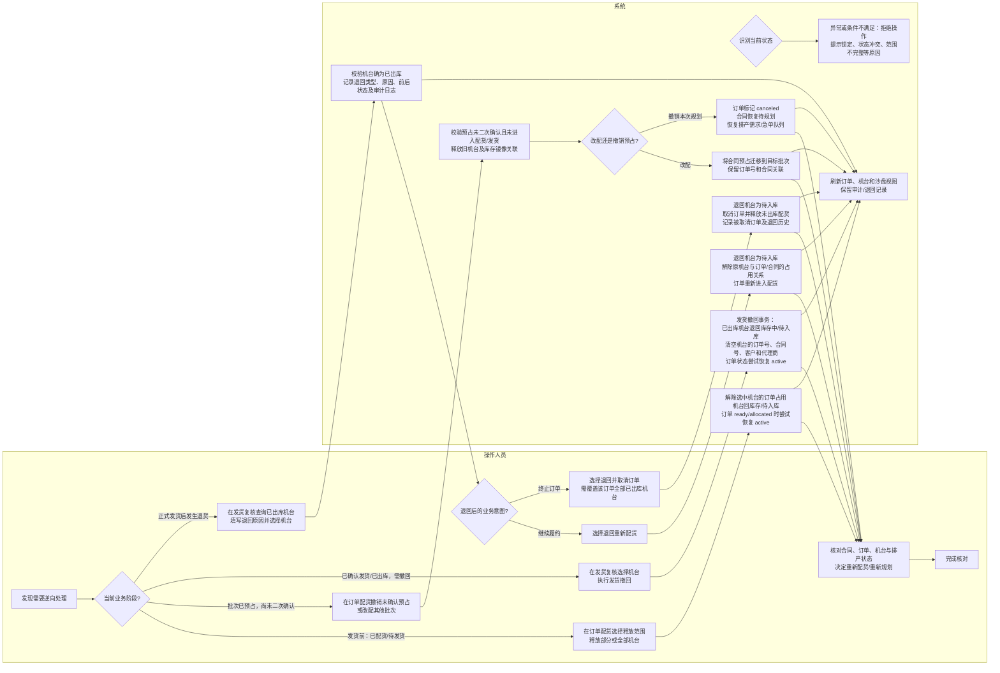

# 发货到合同下单的逆向流程图

本图按当前系统实现整理，区分操作人员和系统处理。图中的“逆向”包含不同业务入口，不能把“发货撤回”“已发货退回”“配货释放”和“撤销预占”当成同一种操作。

## 关键边界

- **发货撤回不等于合同撤销或合同自动回到待规划。** 发货撤回会解除机台的订单号和合同号绑定；操作后需要重新核对订单、合同计划和排产状态。
- **已发货退回有两个不同结果。** “重新配货”保留履约意图并让订单重新配货；“取消订单”要求一次处理该订单全部已出库机台，并取消订单、释放未出库配货。
- **配货释放和撤销预占的范围不同。** 配货释放针对已绑定到订单的机台；撤销预占仅适用于尚未二次确认的批次规划，并将合同恢复为待规划。
- **拒绝条件不是回滚流程。** 例如预占机台已锁定、已经配货/发货，或订单关联与页面数据不一致时，操作会被拒绝，需要先核查状态。
- 退回操作会记录原因/审计或历史数据；流程目标是恢复业务状态，不是抹除历史。

## 代码依据

- `api/routes/inventory.py`：`/shipping/revert`、`/shipping/return`
- `crud/orders.py`：`revert_to_inbound`
- `api/routes/planning.py`：订单配货释放、批次预占撤销/改配入口
- `crud/batch_planning.py`：`change_reservation` 及状态校验
- `frontend/src/views/ShippingReview.vue`、`frontend/src/views/OrderAllocation.vue`：操作入口与界面提示

本图描述代码中可见的流程；未验证当前生产环境配置、用户权限或云端同步结果。
